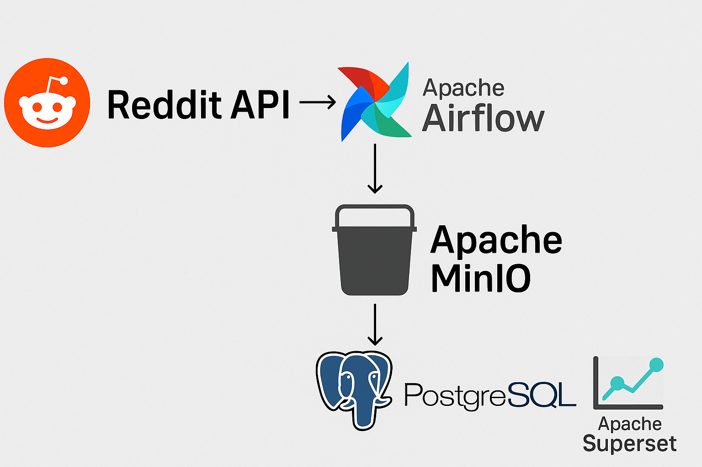

# Simple Batch Processing Pipeline
This is an exercise to have better understanding of docker networking, and common config setups in open source projects

The focus of this project is NOT creating complicated data processing flows, but providing a more holistic view how data flows from external APIs to dockerized services and eventually powers BI solutions like Superset. Hope you have fun modifying it to your unique use case :)

## Flow Overview



## Clone the project repository from github

`$ git clone git@github.com:bxnxiong/batch-processing.git`

`$ cd batch-processing`

## Step 1. creating a Reddit app and get the required credentials. 

You can go to https://www.reddit.com/prefs/apps to get API `client_id` and `client_secret`. I used "script" for personal use. Use "read" for Permissions if you only retrieve data from Reddit.

Use those client_id and client_secret in your `config/config.conf` file as `reddit_client_id` and `reddit_secret_key`.

## Step 2. build and run all services in Docker containers

`$ ./airflow_env_and_run.sh`

This script will then set up environment variables and initialize the project for the first time.

Apache Airflow handles the orchestration, MinIO serves as the object file storage similar to AWS S3(can easily switch to actual AWS S3 as well under config.conf [aws] section). After dag runs Postgres will store data under `reddit` DB, which also has a configured DB connection in Superset so users can create dashboards and charts easily. This connection is created during `docker compose` time

## Step 3. Applying changes to individual services

#### changes config
`config.conf` stores most of the setups, you may want to update AWS settings under `[aws]` section to use a S3 endpoint instead of local MinIO endpoint. 
Superset connection info is stored under `superset/setup_connections.sh` which uses `superset_config/superset_config.py`. Eg. you may want to update DB connections to using MySQL/Redshift/etc., then you can update `SQLALCHEMY_URI` inside `superset/setup_connections.sh`.

#### Add/Update airflow DAGs
make changes under dags/ folder. Airflow scheduler will automatically pick up changes. In case you don't see the DAG showing up, it's possible DAG has some issues. You can inspect by running `docker logs scheduler --tail 20` to quickly debug

#### Adding new docker services
Best place to start is inside `docker-compose.yaml`, you can create a dedicated Dockerfile alongside as well to easily manage project dependencies.

#### Deploy changes to docker
If changes made to individual docker service, here's easy command you can do:(using superset as example)

`docker compose build --no-chace superset`
`docker compose up -d`


## WebUIs and Backend DB inspections

`Airflow` : http://localhost:8082/

username: `admin` password: `admin`

`Minio` : http://localhost:9001/

username: `root` password: `root12345`

`Superset` http://localhost:8088/

username: `admin` password: `admin`


`Postgres`
```
docker exec -it postgres2 bash
psql -U postgres -d reddit
SELECT * FROM pg_catalog.pg_tables WHERE schemaname != 'pg_catalog' AND schemaname != 'information_schema';
-- if need to create separate schema
CREATE SCHEMA subreddit;
```

## References

I referenced most of infra code from this awesome post: https://towardsdev.com/data-engineering-with-reddit-api-airflow-hive-postgres-minio-nifi-trino-tableau-and-superset-6a35bff30fd0
