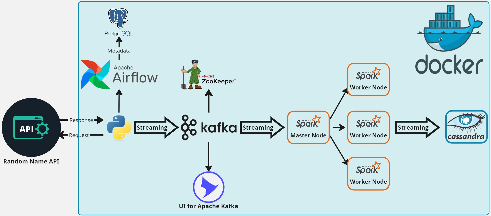
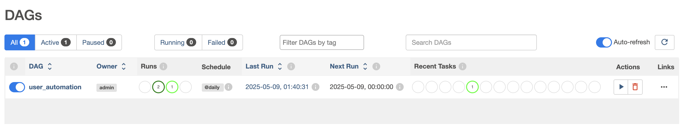
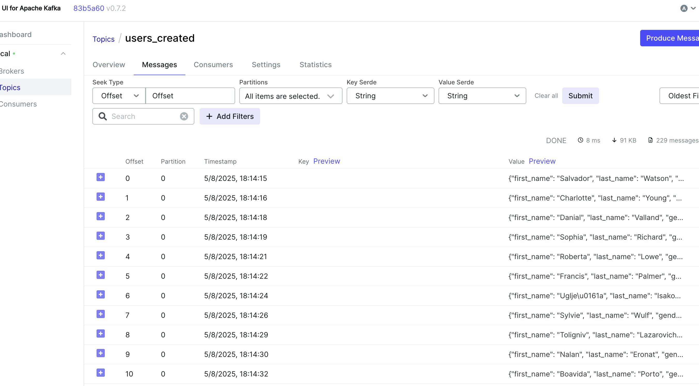
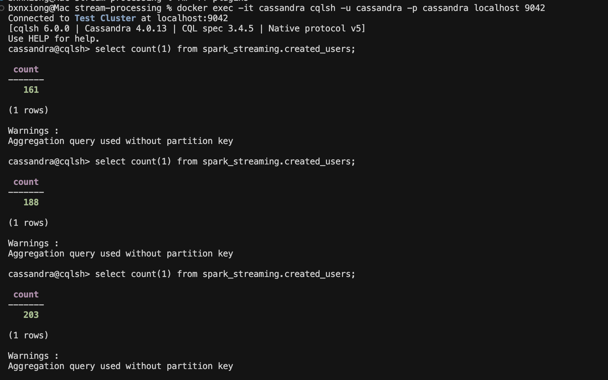

**This repository demonstrates a data engineering pipeline using Spark Structured Streaming. It retrieves random names from an API, sends the data to Kafka topics via Airflow, and processes it with Spark Structured Streaming before storing it in Cassandra.**

# System Architecture

Main technologies: Apache Airflow, Python, Apache Kafka, Apache Zookeeper, Apache Spark, Cassandra, PostgreSQL, Docker 

## Components

**Data Source:** Uses the randomuser.me API for generating user data. \
**Apache Airflow:** Orchestrates the pipeline and schedules data ingestion. \
**Apache Kafka & Zookeeper:** Stream data from PostgreSQL to Spark. \
**Apache Spark:** Processes data in real time. \
**Cassandra:** Stores the processed data. \

## Scripts

**kafka_stream.py:** Airflow DAG script that pushes API data to Kafka during 2 minutes every 1 seconds. \
**spark_stream.py:** Consumes and processes data from Kafka using Spark Structured Streaming. 

## WebUI links

`Airflow`  : <http://localhost:8080/>

`Kafka UI` : <http://localhost:8085/> 

## Steps

### Step 1 Run Airflow init file

`$ sh airflow_env_and_run.sh`

This should launch all required services smoothly. Spark cluster should be ready to accept jobs which we'll do later

### Step 2 Check Cassandra keyspaces

`$ docker exec -it cassandra cqlsh -u cassandra -p cassandra localhost 9042`

Run describe command to see there are no keyspaces named in cassandra instance

`cqlsh> DESCRIBE KEYSPACES;`

### Step 3 Unpause the dag user_automation using Airflow UI

**Go to Airflow UI using :** <http://localhost:8080/>

**Login using** Username: `admin` Password: `admin`

**You can track the topic creation and message queue using the open source tool named UI for Apache Kafka that is running as a container, WebUI link:**  <http://localhost:8085/>

This is what it'll look like after processing some streaming messages:

### Step 4 Submit Spark job to consume messages from Kafka

First copy the dependencies.zip and spark_stream.py files into spark-master container

`$ docker cp dependencies.zip spark-master:/dependencies.zip`

`$ docker cp spark_stream.py spark-master:/spark_stream.py`

Then submit the python job
`$ docker exec -it spark-master spark-submit     --packages com.datastax.spark:spark-cassandra-connector_2.12:3.5.1,org.apache.spark:spark-sql-kafka-0-10_2.12:3.5.1     --py-files /dependencies.zip     /spark_stream.py`

Now our job will start consuming messages from Kafka topic `users_created`

### Step 5 Verify results 

Now go back to the cqlsh shell terminal back and run the command to see data is inserted to cassandra table called created_users
and run count query several times to approve data is being inserted while running user_automation dag

`cqlsh> SELECT count(*) FROM spark_streaming.created_users;`

## References

I made some improvements based on [this great post](https://medium.com/towards-data-engineering/end-to-end-realtime-streaming-data-engineering-project-using-python-docker-airflow-spark-kafka-ab1568c2ad13)